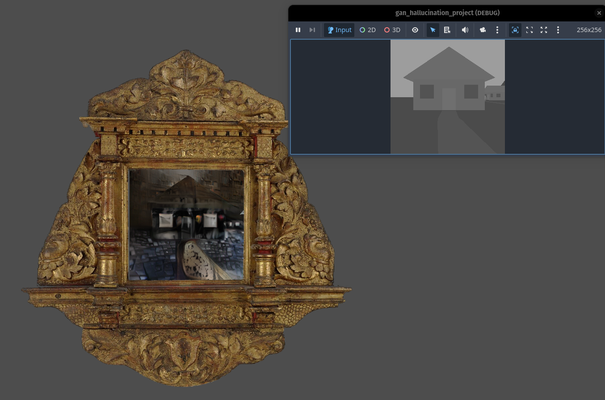
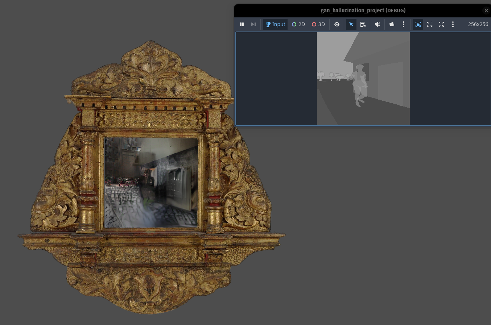
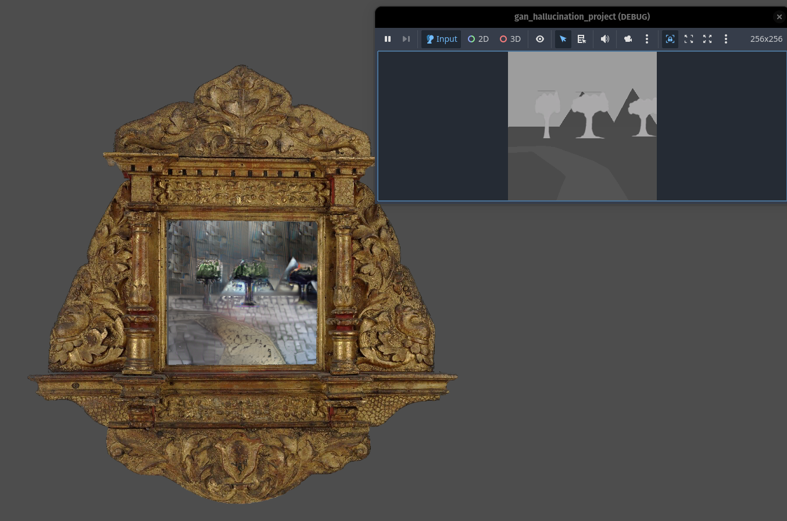
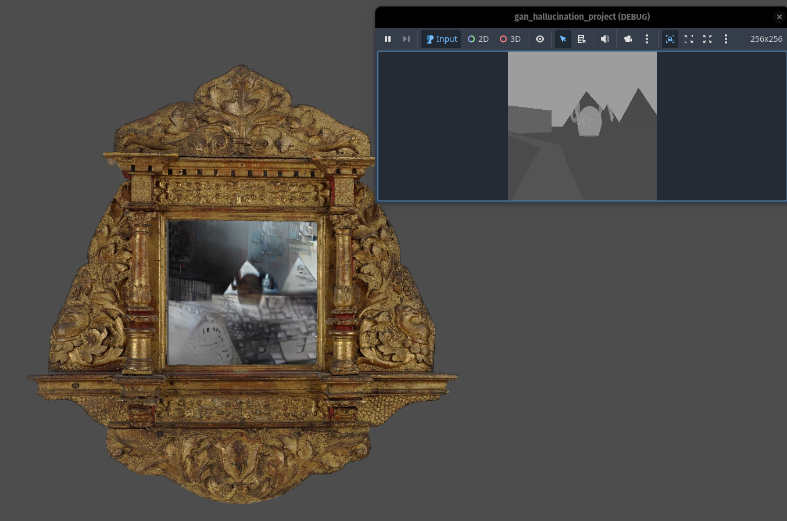
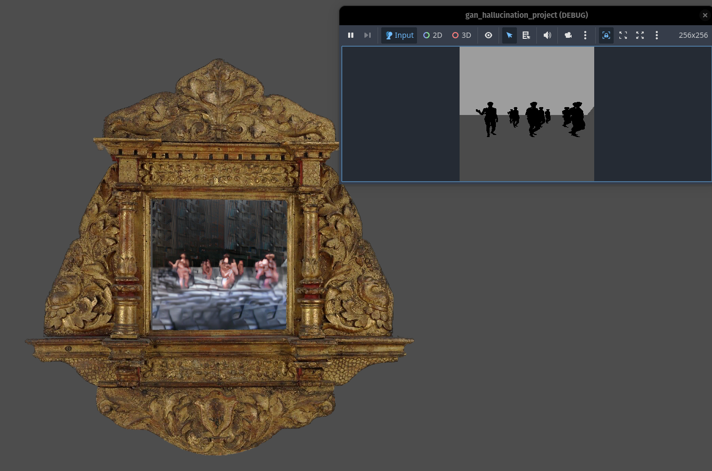

# GAN Hallucination Game

Developed during [Franken Game Jam 2025](https://www.frankengamejam.de/)

This is a prototype of an Adventure game within a dreamy landscape with visuals
provided by "retro" AI image generative models that are heavy on hallucinations.
Strongly inspired by [2019 Nvidia's GauGAN tech demo](https://www.youtube.com/watch?v=mP0REBUeISE) and old
grid-based, step-by-step first-person dungeon crawler games like Might and Magic I–V.

All materials used have greyscale values corresponding to the respective
[labels of a COCO Stuff dataset](https://github.com/nightrome/cocostuff/blob/master/labels.md).

For each position in the 3D space in Godot the current frame is sent via netsocket to a
[Flask Server](https://github.com/tym2k1/CLADE/blob/main/server.py) running the CLADE model.
The server returns the synthesised image which is displayed within UI.

## Images

For more see the [gallery](./img).

## Possible Improvements

- Hardcode possible player positions (tile-system) and pre-render all
possible frames for every postion.
- Re-train the model to allow higher resolution within the output and
the use of noise for image variation (`--use-vae` training flag)

## Attribution

- Based on [CLADE (Efficient Semantic Image Synthesis via Class-Adaptive Normalization)](https://github.com/tzt101/CLADE)

- [COCO-Stuff](https://github.com/nightrome/cocostuff) - dataset used within the model

- [threedscans.com](https://threedscans.com/) - 3D models

- [Metropolitan Museum of Art](https://www.metmuseum.org/) - Photograph of the frame used for UI

- [Gionavvi](https://www.youtube.com/@gionavvi) - NVIDIA's GauGAN demo linked within the README.md
